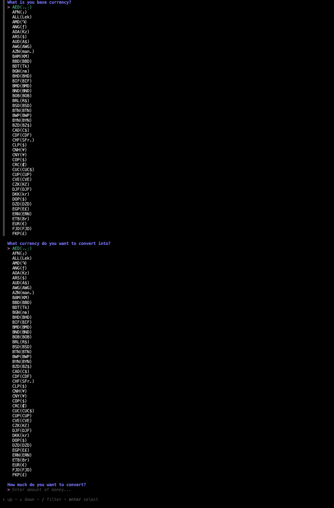
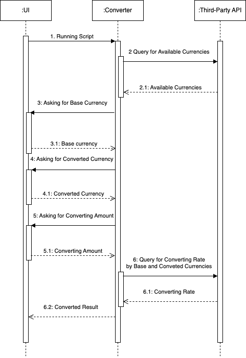
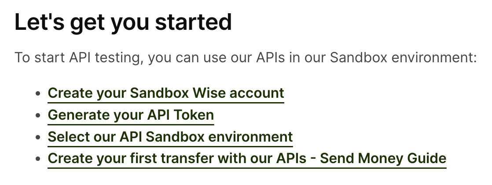

# Currency Converter

## Overview
Easy way terminal currency converting app to calculate an amount of money to different currencies.




## UML
### Components Diagram


### Sequence Diagram


## Technologies Used
[Huh ( UI )](https://github.com/charmbracelet/huh)

    A simple, powerful library for building interactive forms and prompts in the terminal.

[Wise ( Third-Party API )](https://docs.wise.com/api-docs)
   
    The Wise API is a powerful tool that allows businesses to automate their financial transactions and integrate seamlessly with Wise's services. Designed for both small and large enterprises, the API enables users to manage cross-border payments, automate invoice processing, and streamline financial workflows without the need for manual intervention.

## How To Run?

- First Step - You need to create an environment variable file to have accessibility to Wise.

   Instructions 👉 [Wise](https://docs.wise.com/api-docs)

    

    .env
    ```
    API_ADDRESS=https://api.sandbox.transferwise.tech/v1
    API_TOKEN=${{ Your Token }}
    ```

- Second Step - Run the app.

    ```go
    go run main.go
    ```
